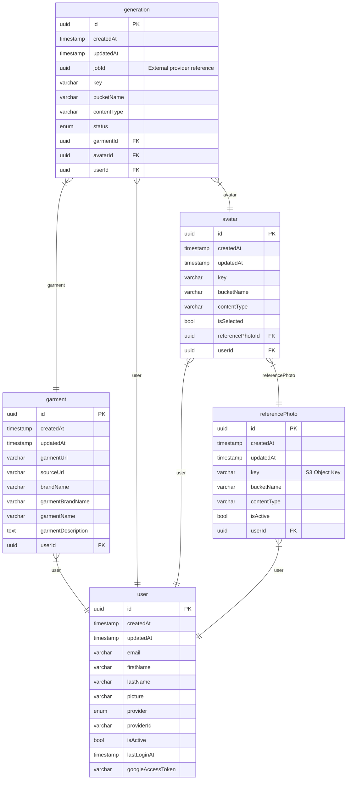

# LYO - System Architecture Documentation

## Overview
LYO is a virtual fitting room that lets users try on clothes in their browser before buying. It works as a Chrome extension on Myntra, a React dashboard for managing avatars, and a NestJS backend that handles the heavy lifting.

```
┌─────────────┐         ┌─────────────┐         ┌─────────────┐
│   Chrome    │         │   NestJS    │         │   React     │
│  Extension  │◄───────►│   Backend   │◄───────►│  Dashboard  │
│  (WXT/React)│         │  (API/SSE)  │         │  (Web App)  │
└─────────────┘         └─────────────┘         └─────────────┘
       │                        │                        │
       │                        │                        │
       └────────────────────────┼────────────────────────┘
                                 │
                    ┌────────────┴────────────┐
                    │                         │
              ┌─────▼─────┐            ┌─────▼─────┐
              │ PostgreSQL │            │   Redis   │
              │  Database  │            │ Cache/Pub │
              └────────────┘            └───────────┘
                    │
              ┌─────▼─────┐
              │    S3     │
              │  Storage  │
              └───────────┘
```

The system has three main parts:

- Backend API (NestJS) - Handles all the business logic, database operations, and integrations.
- Chrome Extension (WXT/React) - Injects into Myntra pages and provides the try-on interface.
- Dashboard (React) - Web app for managing your avatar and viewing your wardrobe.

They all talk to the same backend API and share authentication via cookies.

## Database Schema

We use PostgreSQL with a simple relational model. Here's what we're storing:




# Backend Architecture
- Built with NestJS, which gives us a modular structure. Here's how it's organized:

```
User Uploads Photo
       │
       ▼
┌──────────────┐
│ Reference    │ (isActive = true)
│ Photo        │
└──────┬───────┘
       │
       ▼
┌──────────────┐
│ Avatar       │ (isSelected = true)
│ Created      │
└──────┬───────┘
       │
       ▼
User Browses Myntra
       │
       ▼
┌──────────────┐
│ Garment      │ (extracted from page)
│ Extracted    │
└──────┬───────┘
       │
       ▼
User Clicks "Try On"
       │
       ▼
┌──────────────┐      ┌──────────────┐
│ Generation   │─────►│ Fashnai API  │
│ Created      │      │ (AI Process) │
│ (status:     │      └──────┬───────┘
│  starting)   │             │
└──────────────┘             │
                             │ (webhook callback)
                             ▼
                    ┌──────────────┐
                    │ Generation   │
                    │ Completed   │
                    │ (S3 image)  │
                    └──────────────┘

```

## Request Flow Architecture

```┌─────────────────────────────────────────┐
│           App Module (Root)              │
│  - Global Config                         │
│  - CORS, Validation, Helmet              │
│  - Swagger Documentation                 │
└──────────────┬──────────────────────────┘
               │
    ┌──────────┼──────────┐
    │          │          │
    ▼          ▼          ▼
┌─────────┐ ┌─────────┐ ┌─────────┐
│Database │ │ Modules │ │ Engine  │
│ Module  │ │ Module  │ │ Module  │
└────┬────┘ └────┬────┘ └────┬────┘
     │           │            │
     │           │            │
     ▼           ▼            ▼
┌─────────┐ ┌─────────┐ ┌─────────┐
│PostgreSQL│ │  API   │ │   SSE   │
│ TypeORM  │ │ Module │ │ Module  │
└─────────┘ └────┬────┘ └────┬────┘
                 │            │
                 │            │
                 ▼            ▼
          ┌─────────────┐ ┌─────────────┐
          │  REST APIs  │ │  Webhooks   │
          │  - User     │ │  - Fashnai  │
          │  - Auth     │ │             │
          │  - Tryon    │ │             │
          │  - Wardrobe │ │             │
          └─────────────┘ └─────────────|

```

## Authentication Flow

```
sequenceDiagram
    participant User
    participant Dashboard
    participant Backend
    participant Google
    participant Extension

    User->>Dashboard: Click "Sign in with Google"
    Dashboard->>Google: OAuth Redirect
    Google->>Dashboard: Return with code
    Dashboard->>Backend: POST /auth/google (code)
    Backend->>Google: Validate token
    Google-->>Backend: User info
    Backend->>Backend: Create/Update user
    Backend->>Backend: Generate JWT
    Backend->>Dashboard: Set cookie (access_token)
    Dashboard->>User: Show dashboard
    
    Note over Extension: Extension reads cookie
    Extension->>Backend: API call (with cookie)
    Backend->>Backend: Validate JWT
    Backend-->>Extension: Response


```

## Try-On Generation Flow

```
sequenceDiagram
    participant Extension
    participant Backend
    participant Fashnai
    participant Redis
    participant S3

    Extension->>Backend: POST /tryon/gen (product data)
    Backend->>Backend: Get active reference photo
    Backend->>Backend: Create garment record
    Backend->>Fashnai: POST /run (images + webhook URL)
    Fashnai-->>Backend: jobId
    Backend->>Backend: Create generation (status: starting)
    Backend-->>Extension: generationId (optimistic)
    
    Extension->>Backend: Connect SSE /sse/generation
    Backend->>Redis: Subscribe user:{userId}:generation
    
    Note over Fashnai: Processing (10-30 seconds)
    Fashnai->>Backend: Webhook (base64 images)
    Backend->>S3: Upload images
    Backend->>Backend: Update generation (status: completed)
    Backend->>Redis: Publish completion event
    Redis-->>Backend: Event received
    Backend-->>Extension: SSE event (generation complete)
    Extension->>Extension: Update UI
```

## Caching Strategy 

```

┌──────────────┐
│   Client     │
│ (Extension/  │
│  Dashboard)  │
└──────┬───────┘
       │
       │ HTTP Request
       │ (with cookie)
       ▼
┌──────────────┐
│   NestJS     │
│   Backend    │
└──────┬───────┘
       │
       ├─────────────────┐
       │                 │
       ▼                 ▼
┌──────────────┐  ┌──────────────┐
│   Guards     │  │  Controllers │
│ - JWT Auth   │  │  - Validate  │
│ - Rate Limit │  │  - Route     │
└──────┬───────┘  └──────┬───────┘
       │                 │
       └────────┬────────┘
                │
                ▼
       ┌──────────────┐
       │   Services   │
       │ - Business   │
       │   Logic      │
       └──────┬───────┘
              │
       ┌──────┼──────┐
       │      │      │
       ▼      ▼      ▼
  ┌──────┐ ┌──────┐ ┌──────┐
  │Postgres│ │Redis │ │  S3  │
  │        │ │      │ │      │
  └───────┘ └──────┘ └──────┘

```

### Reference Photo Cache
- Key: users:{userId}:reference-photo:active
- Stores: photo ID, S3 key, presigned URL
- TTL: 1 hour
- Saves database queries for frequently accessed data

### Pub/Sub for Real-Time
- Publisher: Webhook handler publishes generation completion
- Subscriber: SSE controller subscribes per user
- Channel pattern: user:{userId}:generation
- Decouples webhook processing from real-time delivery

## Storage Architecture

```
sequenceDiagram
    participant User
    participant Dashboard
    participant Backend
    participant Google
    participant Extension

    User->>Dashboard: Click "Sign in with Google"
    Dashboard->>Google: OAuth Redirect
    Google->>Dashboard: Return with code
    Dashboard->>Backend: POST /auth/google (code)
    Backend->>Google: Validate token
    Google-->>Backend: User info
    Backend->>Backend: Create/Update user
    Backend->>Backend: Generate JWT
    Backend->>Dashboard: Set cookie (access_token)
    Dashboard->>User: Show dashboard
    
    Note over Extension: Extension reads cookie
    Extension->>Backend: API call (with cookie)
    Backend->>Backend: Validate JWT
    Backend-->>Extension: Response

```

All images go to S3:
- Reference photos: users/{userId}/reference-photo/{photoId}
- Generated try-on results: users/{userId}/generations/{jobId}
- Avatars: users/{userId}/avatars/{avatarId}

We generate presigned URLs (1 hour expiry) so clients can access images directly without hitting our backend.

##  Extension Architecture

Built with WXT framework, which makes Chrome extension development way easier. It's basically React + TypeScript with some extension-specific helpers.

```
sequenceDiagram
    participant Extension
    participant Backend
    participant Fashnai
    participant Redis
    participant S3

    Extension->>Backend: POST /tryon/gen (product data)
    Backend->>Backend: Get active reference photo
    Backend->>Backend: Create garment record
    Backend->>Fashnai: POST /run (images + webhook URL)
    Fashnai-->>Backend: jobId
    Backend->>Backend: Create generation (status: starting)
    Backend-->>Extension: generationId (optimistic)
    
    Extension->>Backend: Connect SSE /sse/generation
    Backend->>Redis: Subscribe user:{userId}:generation
    
    Note over Fashnai: Processing (10-30 seconds)
    Fashnai->>Backend: Webhook (base64 images)
    Backend->>S3: Upload images
    Backend->>Backend: Update generation (status: completed)
    Backend->>Redis: Publish completion event
    Redis-->>Backend: Event received
    Backend-->>Extension: SSE event (generation complete)
    Extension->>Extension: Update UI

```

## Content Script Flow

```
graph TD
    A[User visits Myntra] --> B[Content Script Loads]
    B --> C[Extract Product Metadata]
    C --> D[DOM Parsing]
    D --> E[Store in Chrome Storage]
    E --> F[Send to Background Worker]
    F --> G[Background Updates State]
    G --> H[Side Panel Shows Product]
    
    I[User Clicks Try On] --> J[Content Script Handler]
    J --> K[Message to Background]
    K --> L[Open Side Panel]
    L --> M[Start Generation]

```

# Extension Communication Flow

```
┌──────────────┐
│   Request    │
└──────┬───────┘
       │
       ▼
┌──────────────┐
│ Check Redis  │
│ Cache        │
└──────┬───────┘
       │
   ┌───┴───┐
   │       │
   ▼       ▼
┌─────┐ ┌─────┐
│Hit  │ │Miss │
└──┬──┘ └──┬──┘
   │       │
   │       ▼
   │   ┌──────────────┐
   │   │ Query DB     │
   │   └──────┬───────┘
   │          │
   │          ▼
   │      ┌──────────────┐
   │      │ Store in     │
   │      │ Redis (TTL)  │
   │      └──────────────┘
   │
   ▼
┌──────────────┐
│ Return Data │
└──────────────┘

```

### Background Service Worker
- Runs in the background, handles extension lifecycle
- Manages side panel behavior (opens when extension icon is clicked)
- Routes messages between content scripts and side panel
- Handles generation requests and SSE connections

### Content Scripts
- myntra.content - Injects the "Try On" button into Myntra product pages
- active-tab-product-meta.content - Extracts product metadata from DOM
- product-meta-sync.content - Syncs product state when user changes size or adds to bag

### Side Panel
React app that shows the wardrobe interface
Displays pending and completed try-ons
Handles authentication flow


## Authentication Flow in Extension

```
┌──────────────┐
│   Backend    │
└──────┬───────┘
       │
       │ Upload/Generate URL
       ▼
┌──────────────┐
│      S3      │
│              │
│ users/       │
│   {userId}/  │
│     ├─ reference-photo/
│     ├─ generations/
│     └─ avatars/
└──────┬───────┘
       │
       │ Presigned URL (1hr)
       ▼
┌──────────────┐
│   Client     │
│ (Direct      │
│  Access)     │
└──────────────┘
```

- Extension reads access_token cookie from dashboard domain
- Uses browser.cookies API to check if user is logged in
- If no token, shows sign-in button that redirects to dashboard
- Cookie changes are monitored in real-time

## Dashboard Architecture

- Simple React app built with Vite. Users manage their avatars and view their wardrobe here.

```
┌─────────────────────────────────────┐
│        Chrome Extension             │
│                                     │
│  ┌───────────────────────────────┐  │
│  │   Background Service Worker   │  │
│  │   - Message routing          │  │
│  │   - State management         │  │
│  │   - API calls                │  │
│  │   - SSE connections          │  │
│  └───────────┬───────────────────┘  │
│              │                       │
│    ┌─────────┴─────────┐            │
│    │                   │            │
│    ▼                   ▼            │
│  ┌─────────┐      ┌──────────┐     │
│  │ Content │      │  Side    │     │
│  │ Scripts │      │  Panel   │     │
│  │         │      │  (React) │     │
│  │ - Myntra│      │          │     │
│  │   inject│      │ - Wardrobe│    │
│  │ - Extract│      │ - Auth   │    │
│  │   metadata│    │          │    │
│  └─────────┘      └──────────┘     │
└─────────────────────────────────────┘

```

### Dataflow

```
sequenceDiagram
    participant User
    participant Dashboard
    participant ReactQuery
    participant Backend
    participant S3

    User->>Dashboard: Upload Reference Photo
    Dashboard->>Backend: POST /reference-photo/upload
    Backend->>S3: Upload image
    Backend->>Backend: Create DB records
    Backend-->>Dashboard: Success
    Dashboard->>ReactQuery: Invalidate cache
    ReactQuery->>Backend: Refetch /reference-photo/active
    Backend-->>ReactQuery: Updated data
    ReactQuery->>Dashboard: Update UI

```

### System Integration

```
graph TB
    Start[User Signs Up] --> Upload[Upload Reference Photo]
    Upload --> Dashboard[Dashboard Creates Avatar]
    Dashboard --> Browse[User Browses Myntra]
    Browse --> Extract[Extension Extracts Product]
    Extract --> TryOn[User Clicks Try On]
    TryOn --> Backend[Backend Creates Generation]
    Backend --> Fashnai[Fashnai Processes]
    Fashnai --> Webhook[Webhook Updates DB]
    Webhook --> SSE[SSE Notifies Extension]
    SSE --> Complete[Generation Complete]
    Complete --> Wardrobe[User Views Wardrobe]

```

### Authentication Integration

```
graph TD
    A[User visits Myntra] --> B[Content Script Loads]
    B --> C[Extract Product Metadata]
    C --> D[DOM Parsing]
    D --> E[Store in Chrome Storage]
    E --> F[Send to Background Worker]
    F --> G[Background Updates State]
    G --> H[Side Panel Shows Product]
    
    I[User Clicks Try On] --> J[Content Script Handler]
    J --> K[Message to Background]
    K --> L[Open Side Panel]
    L --> M[Start Generation]

```

### Single Sign-On Flow:
- User signs in on dashboard → Backend sets cookie
- Extension reads same cookie → Automatic authentication
- Both use same token for API calls → Seamless experience


## Real-Time Update Flow

```
┌──────────────┐
│ Myntra Page  │
│ (Content     │
│  Script)     │
└──────┬───────┘
       │
       │ browser.runtime.sendMessage
       ▼
┌──────────────┐
│  Background  │
│   Worker     │
└──────┬───────┘
       │
       ├─────────────────┐
       │                 │
       ▼                 ▼
┌──────────────┐  ┌──────────────┐
│   Backend    │  │  Side Panel  │
│   API Call   │  │  (React UI)  │
└──────────────┘  └──────────────┘

```

## Data Synchronization

```
┌──────────────┐
│  Extension   │
│  Side Panel  │
└──────┬───────┘
       │
       │ Check cookie
       ▼
┌──────────────┐
│ browser.     │
│ cookies API  │
└──────┬───────┘
       │
   ┌───┴───┐
   │       │
   ▼       ▼
┌─────┐ ┌─────┐
│Found│ │None │
└──┬──┘ └──┬──┘
   │       │
   │       ▼
   │   ┌──────────────┐
   │   │ Redirect to  │
   │   │ Dashboard    │
   │   │ (Sign In)    │
   │   └──────────────┘
   │
   ▼
┌──────────────┐
│ Use Token    │
│ for API      │
└──────────────┘

```

## Shared State:
- User Profile: Both apps fetch from /user/me
- Reference Photo: Dashboard uploads, extension uses for generations
- Wardrobe: Both can view, extension shows real-time updates
- Authentication: Shared cookie, single source of truth

## Key Design Decisions

### Why Redis Pub/Sub for SSE ? 
```
sequenceDiagram
    participant User
    participant Dashboard
    participant ReactQuery
    participant Backend
    participant S3

    User->>Dashboard: Upload Reference Photo
    Dashboard->>Backend: POST /reference-photo/upload
    Backend->>S3: Upload image
    Backend->>Backend: Create DB records
    Backend-->>Dashboard: Success
    Dashboard->>ReactQuery: Invalidate cache
    ReactQuery->>Backend: Refetch /reference-photo/active
    Backend-->>ReactQuery: Updated data
    ReactQuery->>Dashboard: Update UI

```

## Why optimistic UI ?
```
graph TB
    Start[User Signs Up] --> Upload[Upload Reference Photo]
    Upload --> Dashboard[Dashboard Creates Avatar]
    Dashboard --> Browse[User Browses Myntra]
    Browse --> Extract[Extension Extracts Product]
    Extract --> TryOn[User Clicks Try On]
    TryOn --> Backend[Backend Creates Generation]
    Backend --> Fashnai[Fashnai Processes]
    Fashnai --> Webhook[Webhook Updates DB]
    Webhook --> SSE[SSE Notifies Extension]
    SSE --> Complete[Generation Complete]
    Complete --> Wardrobe[User Views Wardrobe]
```

## Deployment Architecture

```
┌──────────────┐         ┌──────────────┐
│  Extension   │         │  Dashboard   │
│              │         │              │
│ - Real-time  │         │ - On-demand  │
│   updates    │         │   fetching   │
│ - Optimistic │         │ - Cached     │
│   UI         │         │   queries    │
└──────┬───────┘         └──────┬───────┘
       │                        │
       └──────────┬──────────────┘
                  │
                  ▼
         ┌──────────────┐
         │   Backend    │
         │   API        │
         │              │
         │ - Single     │
         │   source of  │
         │   truth      │
         └──────────────┘

```

### Backend
- Runs on Amazon Lightsail (2-core instance)
- Managed by PM2 (process manager)
- Can run multiple instances for load distribution
- PostgreSQL database (separate instance or managed service)
- Redis for caching and pub/sub

### Extension
- Built with WXT, outputs Chrome extension package
- Published to Chrome Web Store
- Auto-updates when new version is published

### Dashboard
- React app, deployed to Vercel.

All three components are independent but work together through the shared backend.

This architecture handles the async nature of AI processing while giving users a responsive experience. The event-driven design means we can scale the webhook processing independently from the real-time delivery, and the optimistic UI keeps things feeling fast even when backend operations take time

